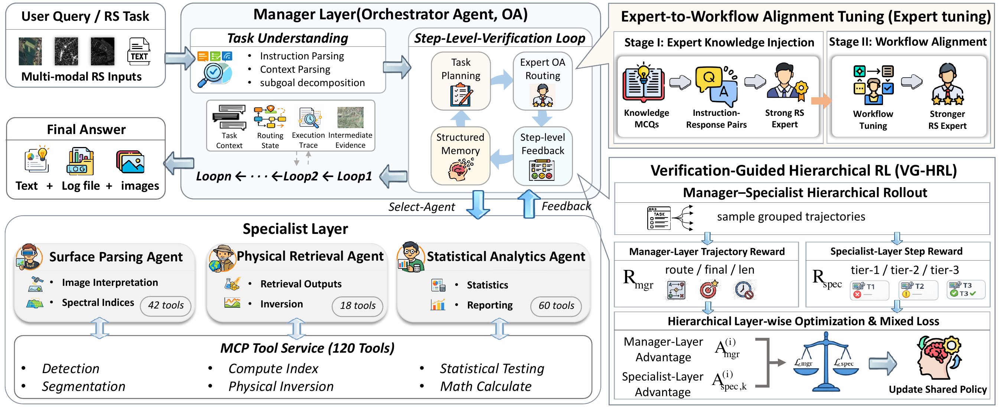
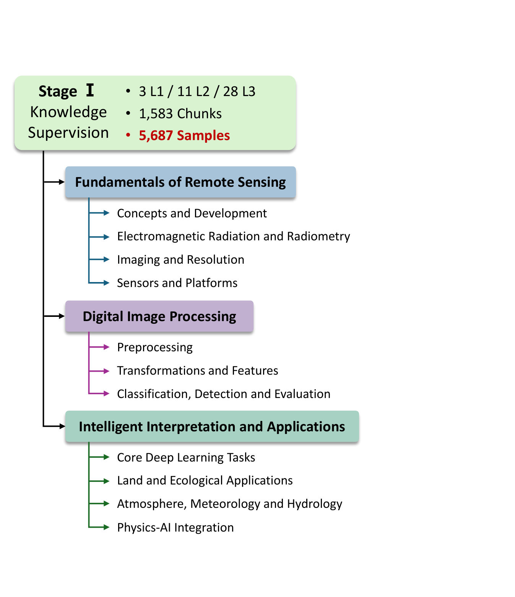
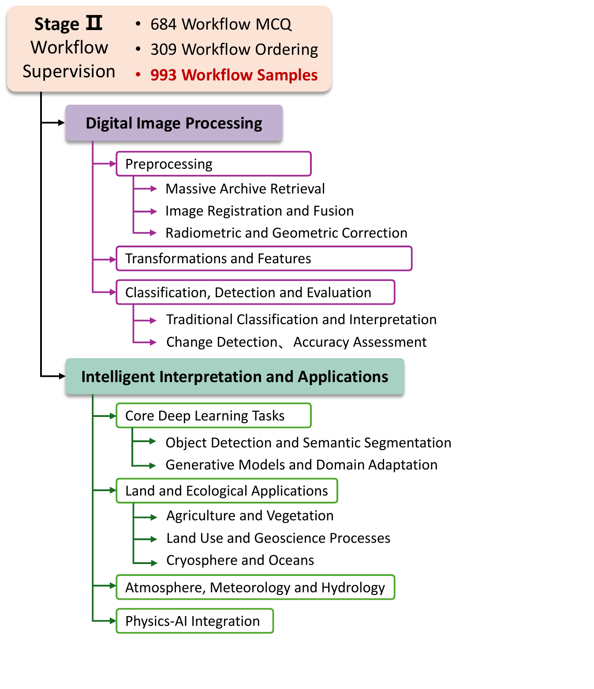
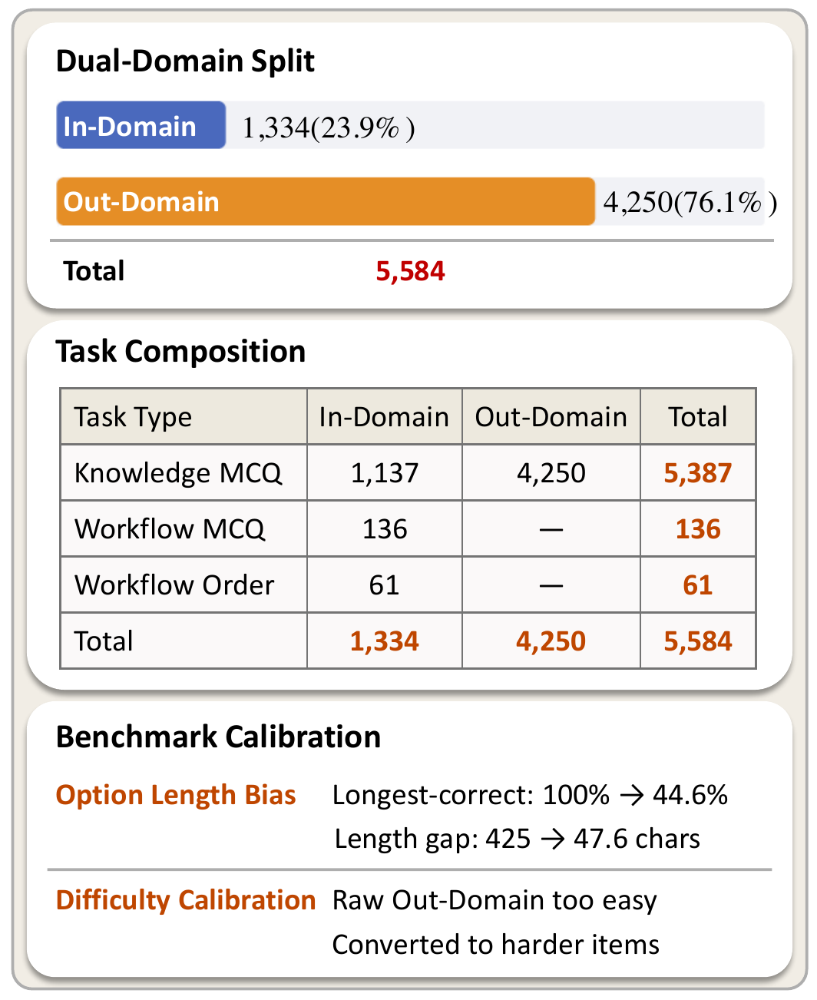

<div align="center">

# HiRS-Agent

### A Hierarchical Multi-Agent System for Reliable Long-Horizon Remote Sensing Task Solving

**Accepted by ACM Multimedia 2026 (ACM MM 2026)**

[](https://2026.acmmm.org/)
[](https://doi.org/10.1145/3767308.3835311)
[](#release-plan)
[](#overview)

<p>
  <a href="https://orcid.org/0009-0008-1854-714X">Boyang Mu</a><sup>1</sup>,
  <a href="https://orcid.org/0000-0002-3494-3686">Zhiwei Wei</a><sup>2</sup>,
  <a href="https://orcid.org/0000-0002-4755-7231">Mugen Peng</a><sup>1</sup>,
  <a href="https://orcid.org/0000-0002-1425-4162">Wenjia Xu</a><sup>1,*</sup>
</p>

<p>
  <sup>1</sup>Beijing University of Posts and Telecommunications &nbsp;&nbsp;
  <sup>2</sup>Hunan Normal University &nbsp;&nbsp;
  <sup>*</sup>Corresponding author
</p>

</div>

<p align="center">
  
</p>

## News

- **2026/08**: HiRS-Agent was accepted by ACM Multimedia 2026.
- **Coming soon**: Source code, checkpoints, training data, benchmark scripts, and reproduction instructions are being prepared for public release.

## Overview

**HiRS-Agent** is a hierarchical multi-agent system for reliable long-horizon remote sensing (RS) task solving. It is designed for complex RS workflows that require multi-step reasoning, tool invocation, intermediate-result interpretation, and adaptive decision-making across long processing chains.

Existing monolithic RS agents often suffer from three mismatches:

- **Workflow mismatch**: generic agent templates do not explicitly model stage dependencies in RS workflows.
- **Knowledge mismatch**: general-purpose LLM backbones are not sufficiently aligned with RS-specific physical, spectral, and statistical knowledge.
- **Control mismatch**: limited intermediate verification makes early errors propagate into downstream analysis and final reports.

HiRS-Agent addresses these issues with a **Manager-Specialist hierarchy**, **RS-specialized tool execution**, and **verification-guided workflow control**.

## Method

<p align="center">
  
</p>
<p align="center">
  <em>Overall architecture of HiRS-Agent, including the Manager Layer, Specialist Layer, MCP tool service, Expert-tuning, and VG-HRL optimization.</em>
</p>

### Manager-Specialist Hierarchy

HiRS-Agent follows a two-level collaborative architecture:

| Layer | Role | Main Responsibilities |
| --- | --- | --- |
| **Manager Layer** | Orchestrator Agent (OA) | Task decomposition, dynamic routing, global memory maintenance, step-level verification, replanning, recovery, and termination control. |
| **Specialist Layer** | Domain-specialized agents | Subtask reasoning and tool execution over stage-aligned RS tool groups. |

The Manager Layer maintains a structured global memory containing task context, routing states, execution traces, and intermediate evidence. After each specialist execution, it verifies the result under RS-specific constraints and decides whether to continue, replan, reroute, cross-check, or terminate.

### RS-Specialized Agents

The Specialist Layer is organized according to the canonical RS workflow:

| Specialist | Workflow Stage | Typical Capabilities |
| --- | --- | --- |
| **Surface Parsing Agent (SPA)** | Spectral parsing and surface understanding | Object detection, segmentation, ROI/mask generation, spectral-index parsing, and region-level interpretation. |
| **Physical Retrieval Agent (PRA)** | Physical retrieval and inversion | Quantitative RS product generation, calibration, normalization, inversion, and quality control. |
| **Statistical Analytics Agent (SAA)** | Spatial/statistical analytics | Data aggregation, cleaning, statistical testing, correlation analysis, metric computation, and report-level comparison. |

This organization reduces cross-domain tool confusion and improves reliability in long-horizon execution.

### Workflow-Aware Training

HiRS-Agent is further optimized with a dedicated training pipeline:

1. **Expert-to-Workflow Alignment Tuning (Expert-tuning)**
   - **Stage I: Expert Knowledge Injection** injects structured RS knowledge from a taxonomy covering fundamentals of RS, digital image processing, and intelligent interpretation.
   - **Stage II: Workflow Alignment** aligns natural-language task intent with executable RS processing procedures.

2. **Verification-Guided Hierarchical Reinforcement Learning (VG-HRL)**
   - Optimizes the Manager Layer with trajectory-level coordination rewards.
   - Optimizes the Specialist Layer with step-level tool-use rewards.
   - Combines the two objectives at the loss level under a shared-parameter backbone.

<p align="center">
  
  
  
</p>
<p align="center">
  <em>Taxonomy-aligned Expert-tuning supervision data and RS-EXPERT-BENCHMARK statistics.</em>
</p>

## Key Results

HiRS-Agent is evaluated on **Earth-Agent Benchmark (Earth-Bench)** and **ThinkGeo**, following the official protocols and tool interfaces.

### Earth-Bench

| Model | Tool-In-Order AP/IF | Tool-Exact-Match AP/IF | Param-Match AP/IF | Accuracy AP/IF |
| --- | --- | --- | --- | --- |
| Qwen3-4B | 1.32 / 10.89 | 0.00 / 8.63 | 0.00 / 4.21 | 15.73 / 10.08 |
| **HiRS-Agent (Qwen3-4B)** | **41.10 / 46.34** | **31.67 / 34.64** | **19.54 / 20.81** | **43.95 / 45.56** |
| HiRS-Agent (Qwen3-8B) | 45.94 / 53.10 | 37.50 / 43.98 | 20.82 / 26.83 | 48.39 / 53.62 |

HiRS-Agent substantially improves ordered tool use, exact tool matching, parameter matching, and final-task accuracy on lightweight open-source backbones.

### ThinkGeo

| Model | Inst. | Tool. | Arg. | Ans. | Ans_I |
| --- | --- | --- | --- | --- | --- |
| Qwen3-4B | 18.35 | 8.54 | 1.24 | 6.07 | 7.79 |
| **HiRS-Agent (Qwen3-4B)** | **73.73** | **47.87** | **8.51** | **11.28** | **13.77** |
| Qwen3-8B | 20.98 | 13.36 | 3.26 | 7.67 | 8.68 |
| HiRS-Agent (Qwen3-8B) | 77.97 | 59.57 | 11.70 | 12.09 | 14.75 |

The results show that HiRS-Agent transfers across different RS tool environments and improves both step-level execution fidelity and end-to-end answer quality.

### RS Expertise and General Capability

Expert-tuning improves RS expertise while largely preserving general capability:

| Model | RS In-Domain | RS Out-Domain | RS Overall | MMLU-Redux | MATH-500 | Multi-IF |
| --- | --- | --- | --- | --- | --- | --- |
| Qwen3-4B Base | 76.43 | 72.42 | 73.35 | 66.57 | 67.80 | 58.35 |
| Qwen3-4B Prompt | 80.13 | 76.54 | 77.37 | 66.53 | 67.60 | 58.30 |
| **Qwen3-4B Expert-tuning** | **95.84** | **85.13** | **87.60** | **66.80** | 66.20 | 55.53 |

## Current Repository Status

This repository currently serves as the official project homepage and release tracker. The public implementation is not included yet and will be released after final packaging.

```text
HiRS-Agent/
├── assets/
│   ├── hirs-agent-overview.png
│   ├── hirs-agent-architecture.png
│   ├── expert-tuning-knowledge.png
│   ├── expert-tuning-workflow.png
│   └── rs-expert-benchmark.png
└── README.md
```

## Release Plan

- [ ] Camera-ready paper link and metadata
- [ ] Inference and evaluation code
- [ ] Manager-Specialist agent framework
- [ ] MCP tool service interface and tool registry
- [ ] Expert-tuning training recipes
- [ ] VG-HRL training recipes
- [ ] Model checkpoints and LoRA adapters
- [ ] Data preparation and benchmark instructions
- [ ] Example cases, logs, and qualitative visualizations
- [ ] Reproducible environment configuration

Please watch this repository for release updates.

## Citation

If you find HiRS-Agent useful, please cite our paper:

```bibtex
@inproceedings{mu2026hirsagent,
  title     = {HiRS-Agent: A Hierarchical Multi-Agent System for Reliable Long-Horizon Remote Sensing Task Solving},
  author    = {Mu, Boyang and Wei, Zhiwei and Peng, Mugen and Xu, Wenjia},
  booktitle = {Proceedings of the 34th ACM International Conference on Multimedia (MM '26)},
  year      = {2026},
  location  = {Rio de Janeiro, Brazil},
  doi       = {10.1145/3767308.3835311},
  isbn      = {979-8-4007-2213-4/2026/11}
}
```

## Contact

For questions or feedback, please open an issue or contact the authors:

- Boyang Mu: muboyang@bupt.edu.cn
- Wenjia Xu: xuwenjia@bupt.edu.cn
