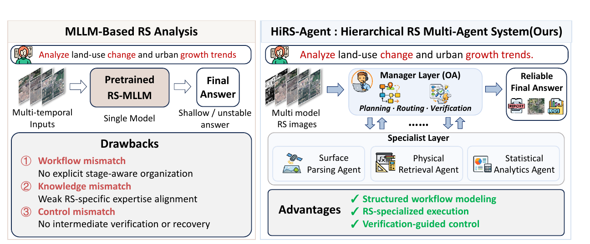

# HiRS-Agent

### A Hierarchical Multi-Agent System for Reliable Long-Horizon Remote Sensing Task Solving

**Accepted by ACM Multimedia 2026 (ACM MM 2026)**

  

## Overview

Remote sensing tasks increasingly require more than one-shot perception: they involve long processing chains with multi-step reasoning, tool invocation, intermediate-result interpretation, and iterative decision-making. Existing monolithic agents can struggle with workflow organization, domain expertise, and error recovery as mistakes propagate across stages.

**HiRS-Agent** is a hierarchical multi-agent system designed for reliable long-horizon remote sensing task solving. It organizes execution through a two-level Manager-Specialist architecture:

- The **Manager Layer** performs task planning, dynamic routing, step-level verification, replanning, and termination control.
- The **Specialist Layer** aligns domain-specific reasoning and tools with the remote sensing workflow, spanning surface parsing, physical retrieval, and statistical analytics.

This structure enables workflow-aware organization, remote-sensing-specialized execution, and verification-guided control throughout a multi-stage task.

## Highlights

- **Hierarchical remote sensing agents.** A Manager-Specialist architecture models the stage-dependent structure of real remote sensing workflows.
- **Verification-guided workflow control.** Intermediate results are checked under domain constraints, enabling rerouting, replanning, and recovery.
- **Expert-to-Workflow Alignment Tuning.** A two-stage supervised tuning strategy first injects remote sensing expertise and then aligns task intent with executable workflows.
- **Verification-Guided Hierarchical Reinforcement Learning.** Layer-aware optimization jointly improves global orchestration and local tool execution.
- **Evaluation across tool environments.** Experiments on Earth-Bench and ThinkGeo demonstrate consistent gains in long-horizon tool use and final-task correctness.

## Results At A Glance

On Earth-Bench, HiRS-Agent with a Qwen3-4B backbone improves final accuracy from **15.73/10.08** to **43.95/45.56** under the AP/IF settings. Tool Exact Match rises from **0.00/8.63** to **31.67/34.64**, while execution efficiency also improves.

On ThinkGeo, the same backbone improves instruction/tool/argument scores from **18.35/8.54/1.24** to **73.73/47.87/8.51**, demonstrating transfer across a different tool library without task-specific optimization on ThinkGeo.

## News

- **2026:** HiRS-Agent was accepted by ACM Multimedia 2026.
- **Coming soon:** Paper, code, model checkpoints, training data, and reproduction instructions.

## Release Plan

This repository currently serves as the official project homepage. The implementation and complete reproduction guide are being prepared and will be released in stages:

- [ ] Paper and citation metadata
- [ ] Inference and evaluation code
- [ ] Training recipes for Expert-tuning and VG-HRL
- [ ] Model checkpoints
- [ ] Data preparation and benchmark instructions
- [ ] Reproducible environments and example cases

Please watch this repository for release updates.

## Citation

The camera-ready BibTeX entry will be added after the complete paper metadata is publicly available.

## Acknowledgements

We thank the developers and maintainers of the open-source models, remote sensing benchmarks, and tool ecosystems that support this research. Detailed acknowledgements will accompany the code release.
